# EnokMethod - The OS for AI Coding Agents

[](https://www.npmjs.com/package/enokmethod)
[](https://github.com/tky0065/enokMethode/actions/workflows/test.yml)
[](https://opensource.org/licenses/MIT)
[](https://nodejs.org)

> **Context-First Spec-Driven Development (CFSD)**
> Stop managing prompts. Start managing context.

EnokMethod is not just a CLI tool; it is an **Operating System for AI Agents**. It injects a structured "Brain" (The Orchestrator) into tools like Claude, Cursor, and Windsurf, enabling them to work autonomously while strictly following your architectural rules.

---

## 🧠 The Core Concept

Traditional AI coding is chaotic: you prompt, it hallucinates, you fix.
**EnokMethod** inverts this. It uses **Context Energy Management** to ensure the AI only acts when it understands the full picture.

### The Enok Flow

```mermaid
graph TD
    User([User Request]) --> Orchestrator{⚡️ Orchestrator Protocol}
    
    Orchestrator -- "No Spec Exists" --> Architect[👷 Architect Agent]
    Orchestrator -- "Spec is Active" --> Developer[👨‍💻 Developer Agent]
    Orchestrator -- "Task Finished" --> Reviewer[🕵️ Reviewer Agent]
    
    Architect --> |Creates| Spec[📝 CURRENT_SPEC.md]
    Spec --> |Guides| Developer
    Developer --> |Writes| Code[💾 Source Code]
    Code --> |Validates| Reviewer
    Reviewer --> |Archives| Memory[🧠 MEMORY.md]
    
    subgraph "Enok Core"
    Context[CONTEXT.md] -.-> Architect
    Context -.-> Developer
    Context -.-> Reviewer
    end
```



---

## 🤖 The Orchestrator Engine

At the heart of EnokMethod is the **Orchestrator Protocol**. Whether you use Claude, Windsurf, or Aider, this logic loop is injected into the AI's system prompt.

### The Autonomous Decision Loop

The AI automatically detects the project state and switches roles without you asking.


---

## ✨ Key Features

- **🚀 Autonomous Workflow Engine**: The AI refuses to code without a plan (Spec) and manages its own lifecycle.
- **🧠 7 Specialized Agents**:
  - **Orchestrator**: The central brain dispatcher.
  - **Architect**: Designs systems and writes specs.
  - **Tech-Lead**: strategies implementation.
  - **Developer**: implementing code strictly.
  - **Reviewer**: Quality assurance.
  - **Documenter**: Maintains README/Docs.
  - **Debugger**: Systematic issue resolution.
- **🔌 Multi-Adapter Support**: Native configuration generation for:
  - **Claude Code** (Best for CLI autonomy)
  - **Cursor** & **Windsurf** (Best for IDE flow)
  - **GitHub Copilot**
  - **Aider**
- 📦 **10 CLI Commands**: `init`, `spec`, `done`, `status`, `list`, `context`, `memory`, `validate`, `commit`, `dev`.

---

## 📦 Installation

Install directly from source (Recommended):

```bash
curl -sSL https://raw.githubusercontent.com/tky0065/enokMethode/main/scripts/install.sh | bash
```

_Requirements: Git and Node.js (v18+) must be installed._

Or run directly via npx (Transient):

```bash
npx enokmethod init
```

---

## 🚀 Quick Start Guide

### 1. Initialize & Choose Adapter

```bash
cd my-project
enokmethod init --adapter claude
# Options: claude, cursor, windsurf, aider, copilot, general
```

### 2. The "Real World" Workflow

**Step A: The Idea (Architect Mode)**
You don't need to write the spec. Just ask.
> *User*: "I want to add a dark mode toggle to the navbar."
>
> *AI (Orchestrator)*: "I see no active spec. Switching to **Architect**. Creating spec 'Dark Mode'..."
> *(AI runs `enokmethod spec` and writes the plan)*

**Step B: The Execution (Developer Mode)**
> *User*: "Looks good, go ahead."
>
> *AI (Orchestrator)*: "Spec found. Switching to **Developer**. Implementing Step 1: Tailwind config..."
> *(AI writes code, runs tests, checks off items)*

**Step C: The Close (Reviewer Mode)**
> *User*: "It works."
>
> *AI (Orchestrator)*: "Great. Switching to **Reviewer**. Validating structure..."
> *(AI runs `enokmethod done`)*

---

## 🔧 Technology Stack

EnokMethod is stack-agnostic but "Context-Aware". It auto-detects your stack during `init`.

| Component | Purpose | Location |
|-----------|---------|----------|
| **CONTEXT.md** | Static Rules (Stack, style, patterns) | `.enokMethod/CONTEXT.md` |
| **MEMORY.md** | Dynamic History (What happened recently) | `.enokMethod/MEMORY.md` |
| **CURRENT_SPEC.md** | The Active Task (Ephemeral) | `./CURRENT_SPEC.md` |
| **ARCHIVE** | Past Specs (Searchable knowledge) | `.enokMethod/archive/` |

---

## 🔌 Adapter Specifics

EnokMethod generates optimized configuration for your specific AI tool:

### 🟣 Claude Code (`--adapter claude`)
Generates a full `.claude/` folder with **Agents** and **Slash Commands**.
- Use `/agents` to see available specialized roles.
- Use slash commands like `/enokMethod:spec "Title"` directly in chat.

### 🔵 Cursor (`--adapter cursor`)
Generates `.cursor/rules/*.mdc` files using the new Rulepads feature.
- **Smart Globs**: Rules apply only when relevant files are touched.
- **Always Active**: The Orchestrator is always watching.

### 🌊 Windsurf (`--adapter windsurf`)
Generates `.windsurfrules` and Cascade flow profiles.
- Optimized for the "Cascade" chat flow.

### 🤖 Aider (`--adapter aider`)
Generates `CONVENTIONS.md` and setups `--read` flags automatically.
- Integrates deeply with git workflows.

---

## 🤝 Contributing

We love contributions! Please read [CONTRIBUTING.md](CONTRIBUTING.md) for details on our code of conduct, and the process for submitting pull requests.

## 📄 License

MIT © [Yacouba Kone](https://github.com/tky0065)
